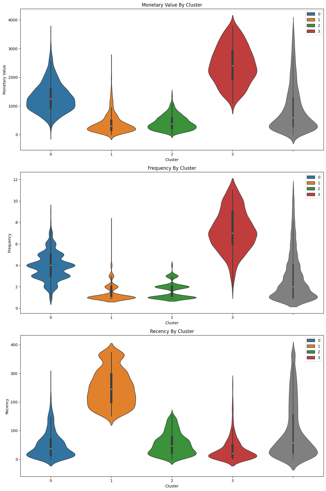
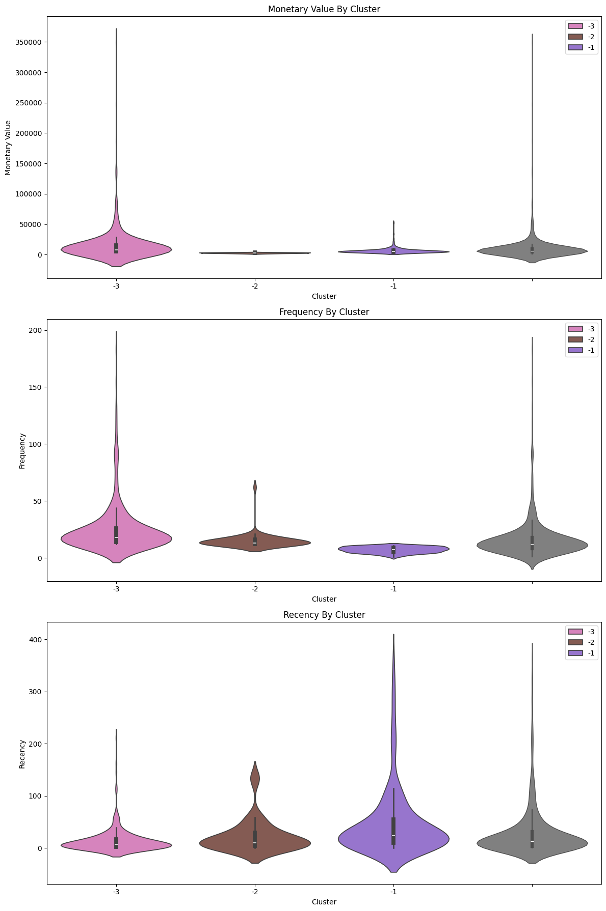

# Clustering Analysis on Online Retail Dataset

## Executive Summary
This project uses **unsupervised machine learning** to segment customers on an online retail dataset. In order to support targeted marketing and business strategy, the objective is to comprehend purchasing behavior and identify significant customer groups.

In order to eliminate returns, invalid transaction, and missing values, and missing values, the dataset was cleaned. Based on their past purchases, customers were profiled using RFM(Recency, Frequency, Monetary) features.

## Business Problem
Thousands of consumers, each with unique purchasing habits and spending trends, are served by online retailers. Without being aware of these distinctions, businesses find it difficult to:

- Determine which clients are most valuable to them.
- Use marketing initiatives to target the appropriate audience.
- Cut down on customer attrition.
- Boost engagement and retention
- Maximize discounts and promotions.
- Distribute resources wisely

Currently, the shop handles every consumer equally, which results in inffective marketing, lost opportunities, and decreased revenue.

## Methodology
1. Understanding the Data
2. Data Cleaning & Preprocessing
3. Feature Engineering (RFM Analysis)
4. Data Scaling
5. Determining Optimal Number of Clusters
6. Customer Segmentation using K-Means
7. Visualization & Exporting Results

## Skills
### Machine Learning:
- Unsupervised learning
- K-Means clustering
- Determining optimal K (Elbow Method, Silhouette Score)
- Interpreting cluster results
### Programming & Libraries:
- Python
- Pandas
- NumPy
- Matplotlib
- Scikit-learn

## Results & Business Recommendation
### Regular Customers:

1. Cluster 0 (Blue): "Retain"

**Rational:** This cluster represents high-value customers who purchse regularly, though not alway very recently. The focus should be on retention efforts on maintain their loyalty and spending levels

**Action:** Implement loyalty programs, personalized offers, and regular engagement ti ensure they remain active.

2. Cluster 1(Orange): "Re-Engage"

**Retionale:** This group includes lower-value, infrequent buyers who haven't purchased recently. The focus should be on re-engagement to bring them back into active purchasing behavior.

**Action:** Use targeted marketing campaigns, special discounts, or reminders to encourage them to return and purchase again.

3. Cluster 3(Green): "Nurture"

**Rationale:** This cluster represents the least active the lowest-value customers, but they have made recent purchses. these customers may be new or need nurturing to increase their engagement and spending.

**Action:** Focus on building relationships, providing excellent customer service, and offering incentives to encourage more frequent purchases.

4. Cluster 3(Red):"Reward"

**Retionale:** This cluster includes high-value, very frequent buyers, many of whom are still actively purchasing. They argite your most loyal customers, and rewarding their loyalty is key to maintaining their engagement.

**Action:** Implement a robust loyalty program, provide exclusive offers, and recognize their loyalty to keep them engaged and satisfied.
### Premium Customers

Cluster -1 (Monetary Outliers) Pamper: 
**Characristics:** High spenders but not necessarily frequent buyers. Their purchases are large but infrequent. 
**Potential Strategy:** Focus on maintaining their loyalty with personalized offers or luxury services that cater to their spending capacity.

Cluster -2 (Frequency Outlires) Upsell:
**Characteristics:** Frequent buyers who spend less per purchase. These customers are consistently engaged but might benifit from puselling opportunities.
**Potential Strategy:** Implement loyalty programs or bundle deals to encourage higher spending per visit, given their frequent engagement.

Cluster -3 (Monetary & Frequency Outlires) Delight: 
**Characteristics:** The most valuable outlires, with extreme spending and frequent purchases. They are likely your top-tier customers who require special attention. 
**Potential Strategy :** Develop VIP  programs or exclusive offers to maintain teir loyalty and encourage continued engagement.

## Next Steps
1. Create Report
2. Create Interective Dashboard

## How to Run This Project

### Set Up
Using python 3.13.5
1. Create a python virtual environment via python -m venv <env_name>
2. Activate the environment via . <env_name>/Scripts/activate or . <env_name>/bin/activate
3. Install requirements via pip install -r requirements.txt

## Auther
**Nafiz Sadiq**  
Data Analyst  
📧 Email: sadiq805144@gmail.com  
🔗 [LinkedIn](https://www.linkedin.com/in/md-nafiz-sadiq-6b508b237/)